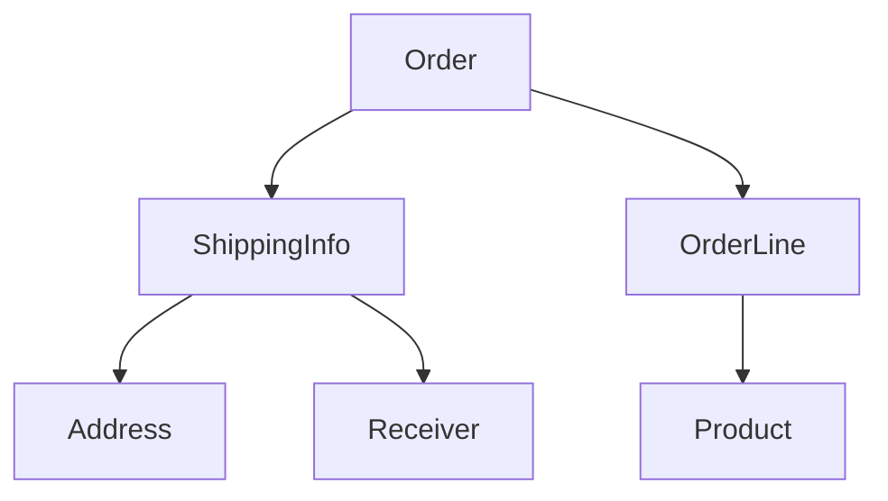

# Aggregate

애그리거트는 연관된 [Entity](Domain%20Element/Entity.md)와 [값 타입](Domain%20Element/Value%20Object.md)을 개념적으로 하나로 묶은 것이다. 

애그리거트는 모델을 이해하는 데 도움을 줄 뿐만 아니라 일관성을 관리하는 기준도 된다. 

## Aggregation Boundary
애그리거트는 경계(boundary)를 갖는다. 한 애그리거트에 속한 객체는 다른 애그리거트에 속하지 않는다. 애그리거트는 독립적인 사이클을 갖는 객체 군이며, 각 애그리거트는 자기 자신을 관리할 뿐 다른 애그리거트를 관리하지 않는다. 

도메인 규칙에 따라 함께 생성되는 구성요소는 한 애그리거트에 속할 가능성이 높다. 예를 들어 주문 상품 개수, 배송지 정보, 주문자 정보는 주문 시점에 함께 생성되므로 이들은 한 애그리거트에 속한다. 

'A가 B를 갖는다'로 설계되는 경우 A와 B를 하나의 애그리거트로 묶기 쉽지만 항상 그런 것은 아니다. 상품과 리뷰의 관계는 위와 같지만, 상품과 리뷰는 함께 생성되지도 않고 함께 변경되지도 않는다. 상품을 생성하는 사용자는 관리자라면, 리뷰를 생성하는 주체는 고객이다. 이들은 다른 애그리거트로 관리하는 것이 유리하다.