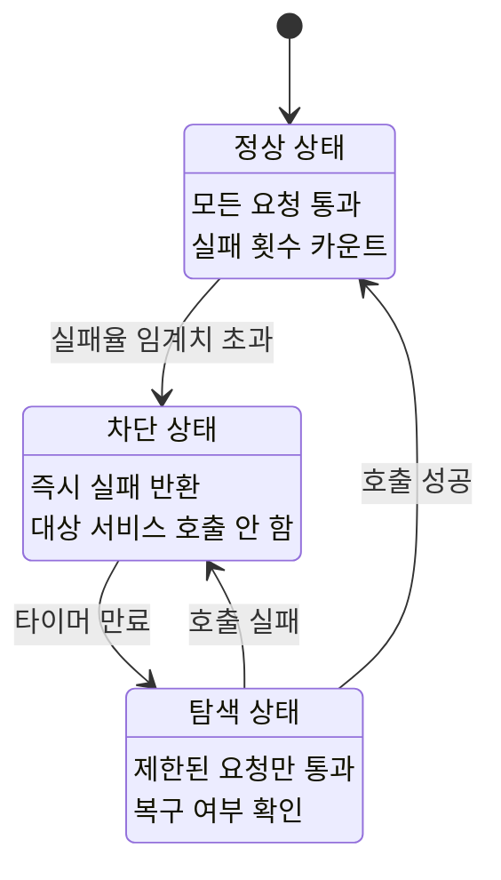

# Circuit Breaker

서킷 브레이커(Circuit Breaker)는 전기 회로의 차단기에서 따온 개념이다. 과전류가 흐르면 차단기가 내려가서 회로를 보호하듯이, 특정 외부 호출이 반복적으로 실패하면 해당 호출 자체를 차단하여 시스템을 보호하는 패턴이다.

## 필요성

MSA 환경에서 서비스 A가 서비스 B를 호출한다고 가정한다. 서비스 B가 장애 상태에 빠졌을 때, 서킷 브레이커가 없으면 다음과 같은 일이 벌어진다.

1. A가 B를 호출하지만 B가 응답하지 않아 타임아웃까지 대기한다.
2. 그 사이 A에 요청이 계속 들어오고, A의 스레드들이 전부 B 응답 대기에 묶인다.
3. A도 응답 불가 상태가 되고, A를 호출하는 서비스 C도 같은 상황에 빠진다.
4. 장애가 연쇄적으로 전파된다(Cascading Failure).

서킷 브레이커는 B가 장애 상태라는 것을 빠르게 감지하고, B 호출 자체를 차단하여 A가 즉시 실패 응답을 반환하도록 만든다. A의 스레드가 묶이지 않으므로 장애 전파를 막을 수 있다.

## 세 가지 상태

서킷 브레이커는 Closed, Open, Half-Open의 세 가지 상태를 갖는다.

**Closed**(닫힘)는 정상 상태이다. 모든 요청이 그대로 통과한다. 실패가 발생하면 실패 횟수를 카운트하고, 임계치를 넘으면 Open으로 전환한다.

**Open**(열림)은 차단 상태이다. 요청을 대상 서비스로 보내지 않고 즉시 실패를 반환한다. 일정 시간이 지나면 Half-Open으로 전환한다.

**Half-Open**(반열림)은 탐색 상태이다. 제한된 수의 요청만 통과시켜 대상 서비스가 복구되었는지 확인한다. 성공하면 Closed로, 실패하면 다시 Open으로 돌아간다.
