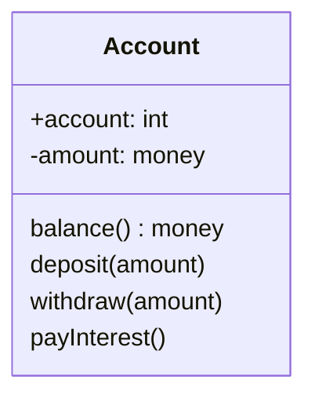

# Class Diagram

Class Diagram은 OO 시스템에 존재하는 클래스를 표현하는 모델링 산출물이다. 시스템을 클래스와 그들의 관계로 표현함으로써, 시스템을 쉽게 이해할 수 있고 구체화하는 데에 도움을 줄 수 있다.

## Attribute

## Operation

* signature
* access modifier

## Association

### Type

### Navigability

### Degree

### Multiplicity

### Role

* Navigability
	* 화살표로 표현
	* 요구사항 모델에서는 그냥 간단히 화살표 없이 표현하기도 함.
* two different classes can be related by several asosciations
* degree
	* unary(reflexive)
	* binary
	* tenary
		* higher degrees are extremely rare
		* more difficult to read
		* so most cases only unary and binary associations
* multiplicity
	* specifies a restriction on the number of objects in a class that may be related to an object in another class
	* lower bound == 0 : optional (may not be related)
	* lower bound > 0 : mandatory (must be related)
	* special cardinalities
		* * -> min 0 max infty -> an unlimited upper bound
		* 1 -> min 1 and max 1
* role
* aggregation and composition
	* show the 'part'
	* aggregation
		* may exist independent
		* participation is optional
	* composition
		* may not exist independent