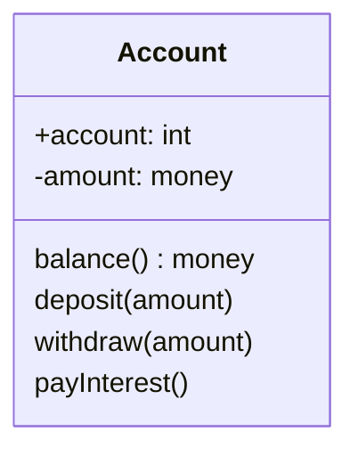

# Class Diagram

Class Diagram은 OO 시스템에 존재하는 클래스를 표현하는 모델링 산출물이다. 시스템을 클래스와 그들의 관계로 표현함으로써, 시스템을 쉽게 이해할 수 있고 구체화하는 데에 도움을 줄 수 있다.

## Attribute
클래스의 속성은 이름, 타입, 가시성(visibility), 초기값(initial value), 다중성(multiplicity), 변경 가능성(changability)를 통해 표현한다. 이 중 이름과 타입은 필수이다.

이름과 타입은 다음과 같이 표현한다.

	age: int

가시성은 속성에 대한 접근 가능한 범위를 나타낸다.

	-age: int

* `+` : 모든 클래스에서 접근 가능
* `-` : 해당 클래스 내부에서만 접근 가능
* `#` : 해당 클래스 및 서브 클래스에서 접근 가능
* `~` : 동일한 패키지 내에서 접근 가능

초기값은 타입 오른쪽에 등호를 사용하여 표현한다.

	-age: int = 19

속성의 개수를 표현하기 위하여 대괄호를 사용한다.

	-age: int[1]
	-emails: String[0..*]

변경 불가능한 속성에 대해서는 주로 {readonly}를 작성해준다.

	-age: int {readOnly}

## Operation

* signature
* access modifier

## Association

### Type

### Navigability

### Degree

### Multiplicity

### Role

* Navigability
	* 화살표로 표현
	* 요구사항 모델에서는 그냥 간단히 화살표 없이 표현하기도 함.
* two different classes can be related by several asosciations
* degree
	* unary(reflexive)
	* binary
	* tenary
		* higher degrees are extremely rare
		* more difficult to read
		* so most cases only unary and binary associations
* multiplicity
	* specifies a restriction on the number of objects in a class that may be related to an object in another class
	* lower bound == 0 : optional (may not be related)
	* lower bound > 0 : mandatory (must be related)
	* special cardinalities
		* * -> min 0 max infty -> an unlimited upper bound
		* 1 -> min 1 and max 1
* role
* aggregation and composition
	* show the 'part'
	* aggregation
		* may exist independent
		* participation is optional
	* composition
		* may not exist independent