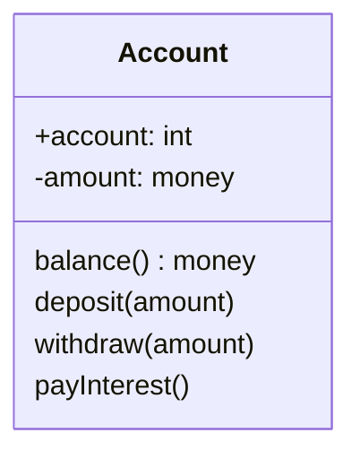

# Class Diagram

Class Diagram은 OO 시스템에 존재하는 클래스를 표현하는 모델링 산출물이다. 시스템을 클래스와 그들의 관계로 표현함으로써, 시스템을 쉽게 이해할 수 있고 구체화하는 데에 도움을 줄 수 있다.

## Attribute
클래스의 속성은 이름, 타입, 가시성(visibility), 초기값(initial value), 다중성(multiplicity), 변경 가능성(changability)를 통해 표현한다. 이 중 이름과 타입은 필수이다.

이름과 타입은 다음과 같이 표현한다.

	age: int

가시성은 속성에 대한 접근 가능한 범위를 나타낸다.

	-age: int

* `+` : 모든 클래스에서 접근 가능
* `-` : 해당 클래스 내부에서만 접근 가능
* `#` : 해당 클래스 및 서브 클래스에서 접근 가능
* `~` : 동일한 패키지 내에서 접근 가능

초기값은 타입 오른쪽에 등호를 사용하여 표현한다.

	-age: int = 19

속성의 개수를 표현하기 위하여 대괄호를 사용한다.

	-age: int[1]
	-emails: String[0..*]

변경 불가능한 속성에 대해서는 주로 {readonly}를 작성해준다.

	-age: int {readOnly}

## Operation
연산(operation)은 클래스의 객체에 대해 수행하거나 객체가 수행할 수 있는 함수를 표현한다. 각 연산에는 이름, 매개변수, 반환 타입, 가시성 등을 표현할 수 있다.

		+calculation(width: double, height: double): double

## Association
Association은 객체 간 발생하는 연관관계의 클래스 레벨에서의 표현이다.

### Type

연관관계는 5 종류가 존재하며, 우측으로 갈 수록 더 강한 결합 관계이다.

* **Dependency** 
	* 점선과 화살표로 표현되며, 일시적인 시간동안만 연관관계를 갖는 경우에 해당한다.
	* ex. 로컬 변수, 파라미터, 반환 타입
* **Association**
	* 직선으로 표현되며, 어떤 객체가 다른 객체를 가지고 있으며 지속적으로 사용될 때에 해당한다.
	* ex. 클래스의 멤버 변수로 다른 클래스 오브젝트에 대한 레퍼런스를 가지고 있는 경우
* **Aggregation & Composition**
	* 다이아몬드로 표현되며, 어떤 객체가 다른 객체의 구성품일 때 사용된다.
	* 이 때, 다이아몬드 측이 전체이고 반대 측이 'part'이다.
	* 비어있는 다이아몬드는 Aggregation으로, 부분에 해당하는 객체가 전체에 해당하는 객체와 별개로 존재할 수 있음을 표현한다.
	* 채워진 다이아몬드는 Composition으로, 부분에 해당하는 객체가 전체에 해당하는 객체에 완전히 종속됨을 표현한다.
* **Inheritance**
	* 빈 화살표와 직선으로 표현되며, 두 클래스가 상속 관계임을 표현한다.

### Navigability

한 클래스에서 다른 클래스에 접근할 수 있는지의 여부를 가시성에 의해 표현할 수 있다.

### Degree

### Multiplicity

객체 간 연관될 수 있는 객체의 개수를 다중성을 통해 표현할 수 있다.

### Role

객체와 객체가 연관되는 경우, 그 연결에는 Role이 필요하다. Role이란 연관관계에서 객체들이 어떤 자격으로 연관관계를 이루는가를 설명하는 문구이다.

## Constratins

제약 조건은 참 또는 거짓으로 평가할 수 있는 문장이다. 클래스 다이어그램에 직접, 혹은 주석을 통해 표현할 수 있으며, 이런 제약을 추가했다면 실제 시스템 구현에서도 이를 반드시 강제해야한다.